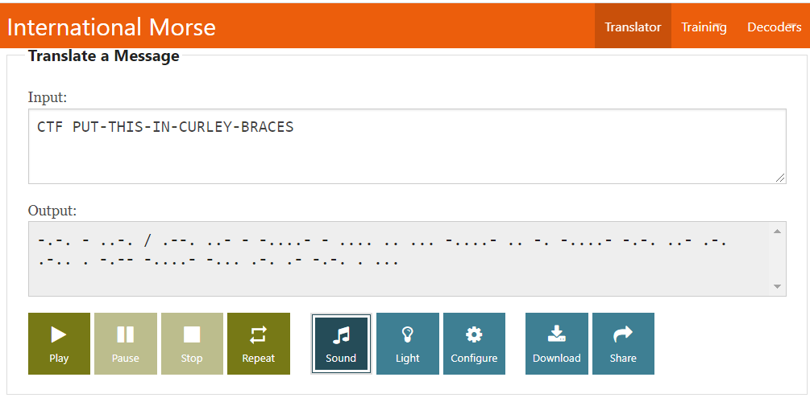

# Dit Dah
**Level**: Very easy

**Points**: 50

**Author**: Justin Applegate

**Description**:
```markdown
Dit Dah

Note - flag is case insensitive

Flag format - `ctf{X-X-X-X-X}`

[steg-flag2.png]
```

## Writeup
Translate from Morse Code



**Flag** - `ctf{PUT-THIS-IN-CURLEY-BRACES}`