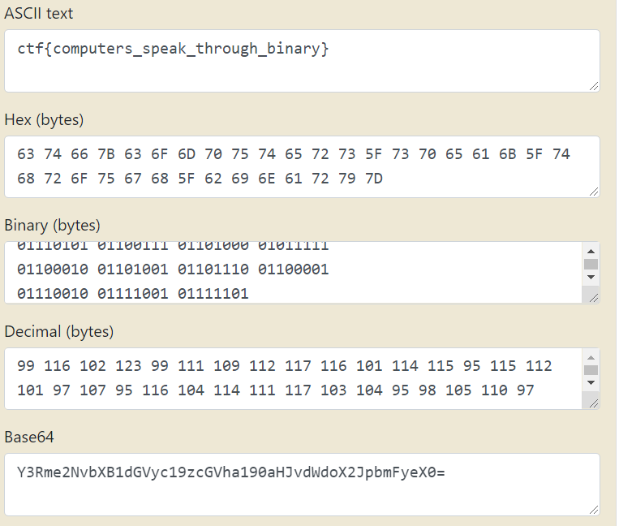

# Simple
**Level**: Easy

**Points**: 50

**Author**: Justin Applegate

**Description**:
```markdown
`01100011 01110100 01100110 01111011 
01100011 01101111 01101101 01110000 
01110101 01110100 01100101 01110010 
01110011 01011111 01110011 01110000 
01100101 01100001 01101011 01011111 
01110100 01101000 01110010 01101111 
01110101 01100111 01101000 01011111 
01100010 01101001 01101110 01100001 
01110010 01111001 01111101`
```

## Writeup
Convert from binary to ASCII



**Flag** - `ctf{computers_speak_through_binary}`