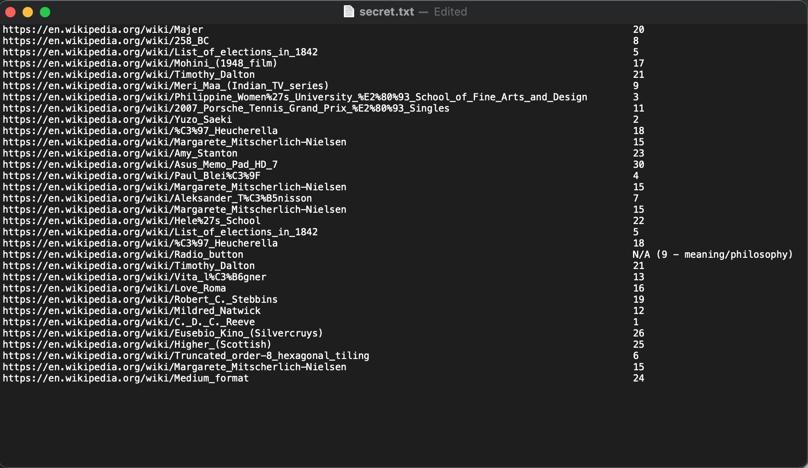

# Wiki Game
**Level**: Hard

**Points**: 650

**Author**: Justin Applegate

**Writeup by**: Tanner Meeves

**Description**:
```markdown
I discovered a phenomenon called "Getting to Philosophy" in Wikipedia - [read up about it](https://en.Wikipedia.org/wiki/Wikipedia:Getting_to_Philosophy) if you don't know what it is. I realized I could use this to send secret messages. 

*Note - "first link in the main text of an English Wikipedia article" means we don't count disambiguations, pronunciations, redirects, words in parentheses or italics, sound clips, citations, template messages, or table of contents as the "first link"*

Flag format - `ctf{phrase}` (case insensitive)

[secret.txt]
```

This challenge was designed to test web scraping and scripting abilities as well the utilization of a number cipher.

## Overview

As part of the challenge, the user is given a file (also in this repository) containing a list of 32 Wikipedia pages, and a [link](https://en.Wikipedia.org/wiki/Wikipedia:Getting_to_Philosophy) to the Wikipedia article describing the parameters of this concept. Upon reading the article, the user would learn that almost any Wikipedia article starting point can lead to the philosophy Wikipedia page strictly by clicking the first link on each page. It also defines the specifications for what the "first link" entails.

## Converting Links to Numbers

Upon receiving the list of Wikipedia articles, the user must work on converting these to numbers. This can be done in one of two ways. The first involves the user manually clicking through each link, counting how many links it takes to reach philosophy and recording that number. This is the approach that I took and the results are shown below.



> Note: Not all of these numbers are accurate. This was as far as I got on my first attempt.

The second involves the utilization of a python script. User Mohamed2del wrote a [script](https://github.com/Mohamed2del/Getting_into_Philosohpy) that performs the algorithm of clicking on the first link recursively of each page until arriving at the Philosophy page. This code needs to be updated to be python3 compatible, but can then be used to quickly gather the same numbers achieved using the first method.

## Understanding the Number Cipher

After acquiring the numbers associated with each article, the user must then recognize that all of the numbers fall between 1 and 26 (On my first attempt there were a few errors that caused there to be some higher numbers). This should logically connect the user to a number cypher where each letter of the alphabet is represented by a number indicating its chronological place. I utilized [cyberchef](https://gchq.github.io/CyberChef/) as an online tool to convert this, however there are many other tools that will do it as well. Shown below is my first attempt to convert it to letters.


Upon analyzing my output I realized that I was really close and corrected a few errors to eventually get the correct flag.

**Flag** - `ctf{thequickbrowndogoverjumpslazyfox}`