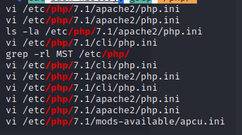
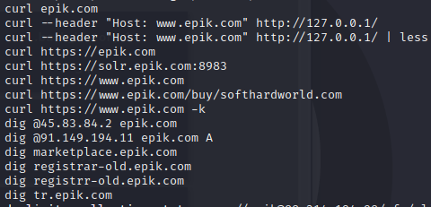
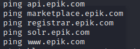
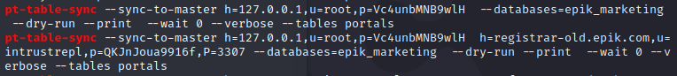
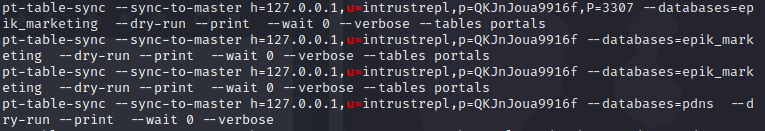
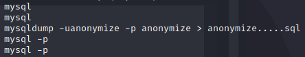
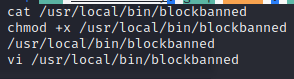
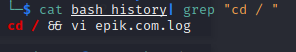

# .bash_history

**Level**: Hard

**Points**: 487

**Author**: Justin Applegate

**Writeup by**: Richard Fountain

**Description**:
```markdown
The website `epik.com` was recently breached by Anonymous, and all we've been able to get from them is a `.bash_history` file. I have a few questions, and hope you can answer them for me! There are 7 questions total which do not have to be completed in order.

Disclaimer - this is the actual `.bash_history` file from the breach (except one line I added in), so please do not investigate or poke at any IP addresses or domains here because they are real.
```

## .bash_history 1
### Description
```markdown
Question 1 - What version of PHP did they use?
```
### Writeup
A `.bash_history` file is a history of commands that a user would have input via the command line. This being known, if a user were working within a PHP environment they would have likely navigated to the php folder which contains another folder simply titled the PHP version number. This can be viewed by concatenating the `.bash_history` file and using a `grep` command as follows:

```shell
cat bash_history| grep "/php/"
```


As can be seen in the results, a folder for version 7.1 can be seen. A user had edited various configuration files contained within the php folder. This answers the first question.

**Flag** - `ctf{7.1}`

## .bash_history 2
### Description
```markdown
Question 2 - Make a list of all subdomains for `epik.com` that are present in this file. What's the last one alphabetically?
```
### Writeup
A subdomain is a domain that is a part of a larger domain under the Domain Name System (DNS) hierarchy. A user's bash history concerning a subdomain could contain some kind of network related commands. The subdomain will likely be in the format of `subdomain.epik.com`. Again using `grep` while concatenating the `.bash_history` file the file can be quickly searched. The following command was used:

```shell
cat bash_history| grep ".epik.com" | sort | uniq
```

By sorting the output and deleting repeat information using `uniq` the information becomes much more readable. The commands  `curl` ,`ping`, and `dig` stood out and could be seen sorted in alphabetical order.





Out of the subdomains listed, `tr.epik.com` is the last one alphabetically answering question 2.

**Flag** - `ctf{tr.epik.com}`

## .bash_history 3.1
### Description
```markdown
Question 3 - There are credentials to a MySQL Database for 3 users. What are their usernames and passwords? (note - there are three separate challenges for this question, 
a challenge for each user. See details on which username/password combination to enter below)

Question 3.1 - What is the root password?
```
### Writeup
In order to access a MySQL database as root a user must use the command `mysql` provided with a password in order to log in. This can be done using the command `mysql -u root -p` followed by entering a password. Just searching for this command using `grep` does not result in any findings. Trying to find `-u root` does not result in any findings either. The following command was run to search for every instance of root.

```shell
cat bash_history| grep "root"
```

An interesting command could be seen containing `u=root` called `pt-table-sync` which contained the root user's password in **plain text** (I guess we can see now why epik had a security breach).



`pt-table-sync` is a one-way and bidirectional synchronization of table data within a MySQL database. In this case the user typed their password into the command in plain text answering question 3.1.

**Flag** - `ctf{Vc4unbMNB9wlH}`

## .bash_history 3.2
### Description
```markdown
Question 3 - There are credentials to a MySQL Database for 3 users. What are their usernames and passwords? (note - there are three separate challenges for this question, 
a challenge for each user. See details on which username/password combination to enter below)

Question 3.2 - There are two other MySQL username/password pairs. What is the first one alphabetically?
```

### Writeup
For this problem, rather than looking for root, there are two other MySQL users. The first alphabetically will be used for the flag. With the information from the previous question about MySQL users being used to authenticate with `pt-table-sync` a `grep` command can be run to see if there are any other users being used in syncing tables. A single user `intrustrepl` can be found along side root. 



Another user must be found before their order can be determined alphabetically. A few other `grep` commands were run to try and sort the information further with no luck. A more general command was run which is the following:

```shell
cat bash_history| grep "mysql" | sort | uniq
```

The information here is still a little dirty, but much more readable. Toward the bottom a `mysqldump` command was called by the user `anonymize`. This user seems to be the first alphabetically providing the answer to this question.



**Flag** - `ctf{anonymize_anonymize}`

## .bash_history 3.3
### Description
```markdown
Question 3 - There are credentials to a MySQL Database for 3 users. What are their usernames and passwords? (note - there are three separate challenges for this question, 
a challenge for each user. See details on which username/password combination to enter below)

Question 3.3 - There are two other MySQL username/password pairs. What is the second one alphabetically?
```

### Writeup
With the information from Question 3.2 above, this question can be easily solved. By using `grep` and looking for `pt-table-sync` the second username/password pair can be found in plain text. The user `instrustrepl` comes second alphabetically.


**Flag** - `ctf{instrustrepl_QKJnJoua9916f}`

## .bash_history 4
### Description
```markdown
Question 4 - What is the full path for the custom script used to ban malicious IPs?
```
### Writeup
A common practice for organizations is to have pre-built custom scripts to automate certain practices. In this case, a custom scripte used to ban malicious IP addresses must be found.  By running the following command, any instance of ban in the `.bash_history` can be filtered:

```shell
cat bash_history| grep "ban" | sort | uniq
```



A file named `blockbanned` can be seen and even given executable privileges with the command `chmod +x`. This likely indicates that it is a custom script, answering question 4.

**Flag** - `ctf{/usr/local/bin/blockbanned}`

## .bash_history 5
### Description
```markdown
Question 5 - What is the name of the log file stored in the root directory (`/`, not `/root`)?
```

### Writeup
In order for a user to work out of the root directory, it must first be navigated to by changing directories. This can be done with a simple `cd /` command. If there was a log file stored in the root directory, the user of this bash_history likely had to navigate there before viewing or editing this file. A `grep` command using the following syntax was used to filter for this information:

```shell
cat bash_history| grep "cd / "
```

The space after the `/` is vital as it sorts out all other directories that may have been navigated to.



A single command is returned in the bash_history containing both navigation to the root directory and a log file, answering question 5.

**Flag** - `ctf{epik.com.log}`

## Real-Word Application
The purpose of this challenge was to both test the competitors' command line knowledge, as well as, show what kinds of information can be recovered from a data breach. Just from a single user's `.bash_history` file, we were able to recover root passwords, log files, custom scripts, subdomains, and other sensitive information. A malicious actor could use this information to harm organizations and consumers who use their service.

If at any point during this writeup you thought to yourself, "How did they just know that command?" it is because I have spent many years working with bash. That being said all of these commands can be found by beginners. When faced with a problem ask yourself (and Google) questions to try and help understand the issue as well as the command line. Questions such as "How to login to MySQL as root via command line?" or "How to sort a grep command alphabetically?" can be very helpful in improving your command line skills. 