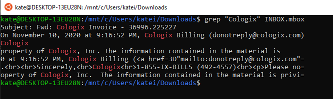
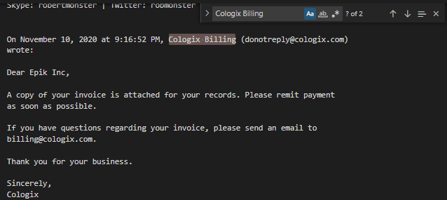
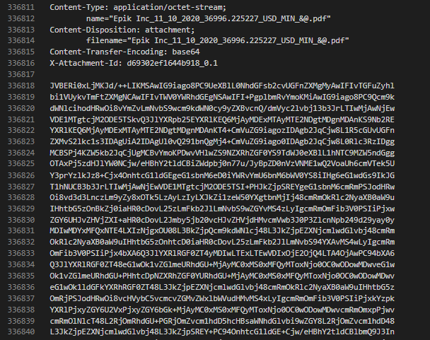
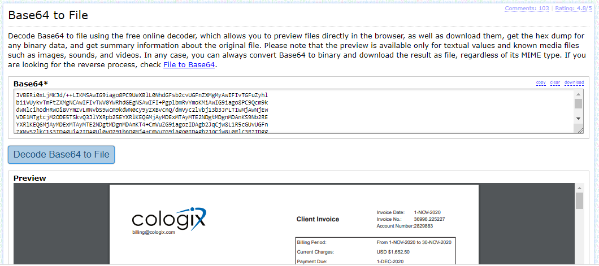

# Routing
**Level**: Hard

**Points**: 482

**Author**: Justin Applegate

**Writeup by**: Kate Boekweg

**Description**:
```markdown
I had a friend send me a bunch of emails that were recovered from the Epik.com breach. What is the ACH Routing number for Cologix?

Example flag - ctf{00000000}

* Disclaimer * - these are actual emails from the breach, so please be careful and do not interact with any IP addresses or domains found here.

[INBOX.mbox]
```

## Writeup
1. Grep File to Find Relevant Lines  

The first thing that I did was download the file and in the Linux command line run `grep "Cologix" INBOX.mbox`. This printed out all lines in the file that had the word "Cologix". In the results of this command, there was one line that I was most interested in: "Cologix Billing". Since I was searching for an ACH routing number, this seemed relevant. 



2. View Relevant Line in a File Editor  

After finding the relevant line, I opened the file in Visual Studio Code and searched the file using 'Ctrl + f'. Searching for "Cologix Billing" brought me to an email, very deep in the file, that said to contain a copy of an invoice. Scrolling to the end of this email, I found two attachments and their base 64 encoding. The attachments were a PNG and a PDF.   

 



3. Convert Base64 back to PDF  

After finding the Base64 encoding of the PDF, I placed it in the online tool [Base64 Guru](https://base64.guru/converter/decode/file) to convert it back to a PDF file. The PDF file was the invoice mentioned in the email and from it I was able to find the ACH routing number.



**Flag** - `ctf{102001017}`

## Real World Application
This challenge was a good way to learn how to effectively search through large files for small pieces of information. The email that we needed to find in this challenge was found around line 336600 of the file. Trying to find that email by scrolling through the file would have taken much too long. This challenge was a great way to learn what tools and techniques can be used to find specific information in large files. 