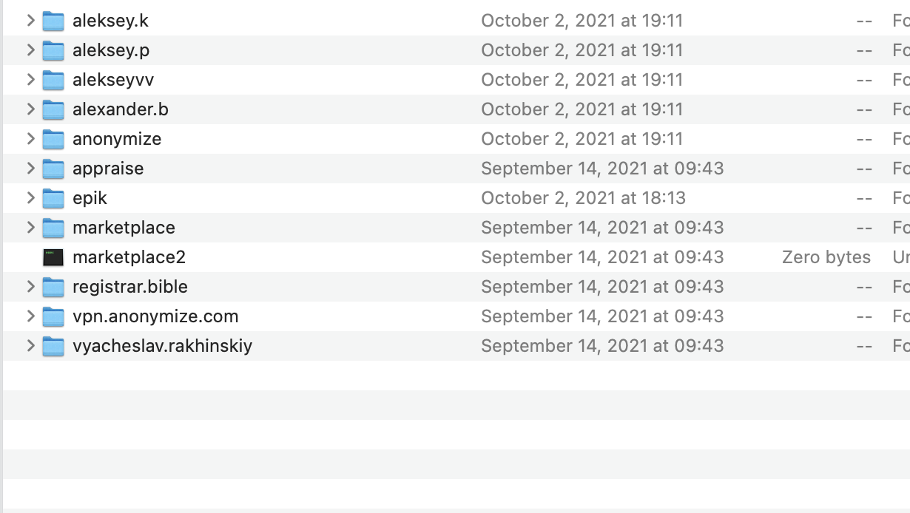

# Wordpress
**Level**: Hard

**Points**: 500

**Author**: Justin Applegate

**Writeup by**: Sebastian Hayes

**Description**:
```markdown
I was also able to recover the `/home` directory from `epik.com's` server! They're using WordPress! I know there is a user whose username is 3 characters long, what is the password for this user?

Example flag - `ctf{password}`

**Disclaimer** - this is the actual `/home` directory from the breach, so please be careful and do not interact with any IP addresses or domains found here. Please let us know if any inappropriate content is found.

File - https://drive.google.com/file/d/17KZnp951LE94zdqqDxW8wlP9Bcmia48g/view?usp=sharing
```

## Writeup
After downloading and unzipping the source file we see the following list of files and folders. Since the challenge specifies Epik as the home directory, we are going to be looking at that. 



The first file of interest for me was the `test.php` file.


Opening this file, I saw a username and password in plain text for a database user and while this is a 3 letter username this is not the password that the challenge was looking for. However, given there is a password and username stored in plain text that gave me the indication that it was likely the bash history. 


The next step was to go through the `.bash_history` file. A quick such using the keyword 'user' in the bash file quickly revealed the user 'alp' and the password for that user account. 


The user was the one the problem was looking for and the password found here in the `.bash_history` was the correct password for the flag. 

**Flag** - `ctf{2WKav3jDs$B7F}`

## Real-World Application
Looking back at this challenge and learning more about `.bash_history` files whenever there is a problem that is looking for a username and password, it is more than likely that we can find the username and password in the `.bash_history` file. However, it is not always as easy as just searching for the keyword 'user' another option could be to search '-u', or in more complex situations a regex expression can be used to find the user.

If you'd like to learn more about `.bash_history` files, here's a great 30 minute video that goes over it - [BASH History Masterclass](https://www.youtube.com/watch?v=gc1io4J3-wg)!