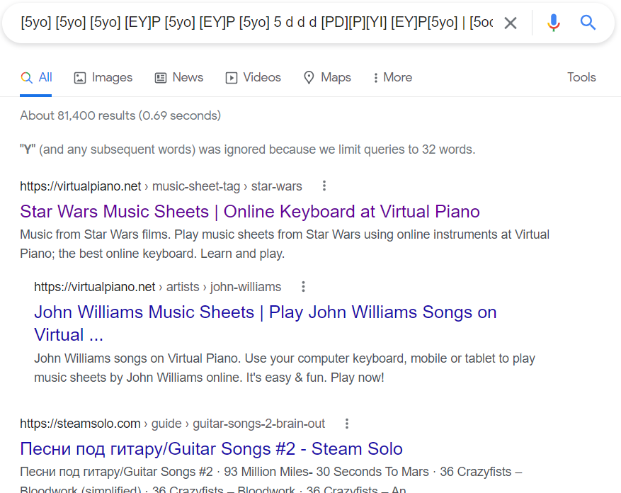

# Composer
**Level**: Easy

**Points**: 183

**Author**: Justin Applegate

**Description**:
```markdown
Who composed this song?

`[5yo] [5yo] [5yo] [EY]P [5yo] [EY]P [5yo] 5 d d d [PD][P][YI] [EY]P[5yo] | [5odh] [5o]o [5odh] G g fDf O [TOS] sa [IP]p[IP] Y[YI] [EY]IP oPd | [5odh] [5o]o [5odh] G g fDf O [TOS] sa [IP]p[IP] Y[YI] [EY]P[5yo] [EY]P[5yo]`

Flag format - `ctf{composer name}` (case insensitive)
```

## Writeup
A simple Google search with the seemingly random text gives a result for a Star Wars song on [virtualpiano.net](https://virtualpiano.net/music-sheet-tag/star-wars/) written by John Williams.



**Flag** - `ctf{john williams}`