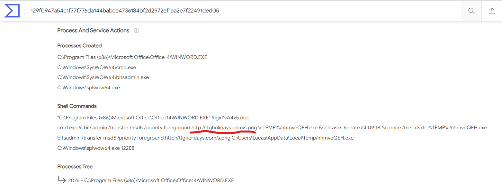

# Linked Domain
**Level**: Medium

**Points**: 397

**Author**: Justin Applegate

**Description**:
```markdown
Our antivirus detected a malicious file on our machine and has given us the hash:

`a259082f33573151375ea00df28468fd`

We'd like to know more information about it. 

-----------------

This file makes a shell command with a URL inside of it. What is the full URL contained?

Flag format - `ctf{http://domain.tld/file.extension}`
```

## Writeup
The Behavior tab of [VirusTotal's report on the malware](https://www.virustotal.com/gui/file/129f0947a54c1f77f776da144babce4736184bf2d2972ef1aa2e7f22491ded05/behavior/Lastline) contains all the shell commands run by the program.



**Flag** - `ctf{http://ttgholidays.com/s.png}`