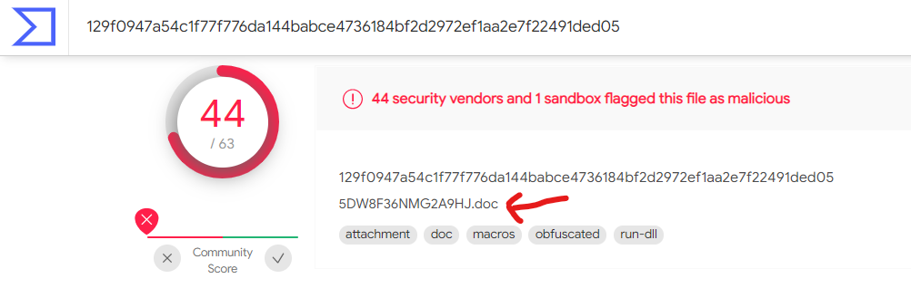

# Name
**Level**: Easy

**Points**: 397

**Author**: Justin Applegate

**Description**:
```markdown
Our antivirus detected a malicious file on our machine and has given us the hash:

`a259082f33573151375ea00df28468fd`

We'd like to know more information about it. 

-----------------

What is the name of this file?

Flag format - `ctf{fullname.type}` (case insensitive)
```

## Writeup
The top of [VirusTotal's report on the malware](https://www.virustotal.com/gui/file/129f0947a54c1f77f776da144babce4736184bf2d2972ef1aa2e7f22491ded05) contains the name of the Word document.



**Flag** - `ctf{5DW8F36NMG2A9HJ.doc}`