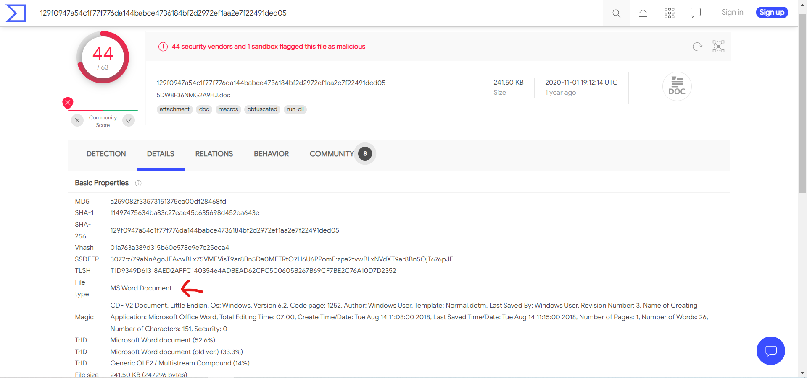

# Program
**Level**: Easy

**Points**: 379

**Author**: Justin Applegate

**Description**:
```markdown
Our antivirus detected a malicious file on our machine and has given us the hash:

`a259082f33573151375ea00df28468fd`

We'd like to know more information about it. 

-----------------

What commonly used software does this malware call/use?

Flag format - `ctf{program}` (case insensitive)
```

## Writeup
The Details tab of [VirusTotal's report on the malware](https://www.virustotal.com/gui/file/129f0947a54c1f77f776da144babce4736184bf2d2972ef1aa2e7f22491ded05/details) lists Microsoft Word as the document type.



**Flag** - `ctf{word}` and multiple variations