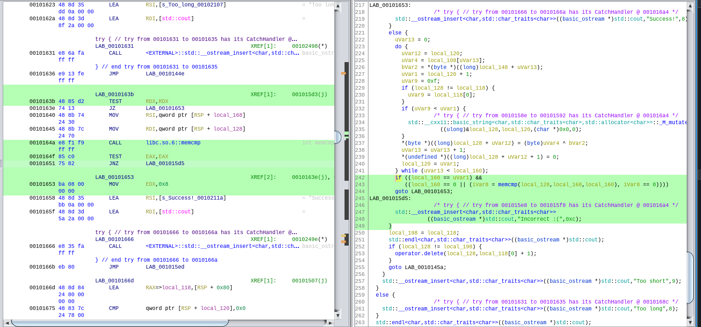

# XOR
**Level**: Hard

**Points**: 500

**Author**: Justin Applegate

**Writeup by**: Noah Walker

**Description**:
```markdown
This one should take you a hot second :)

[rev]
```

## Writeup
XOR is a nifty reverse engineering challenge, with little more to go off of than the name and the description "This one should take you a hot second :)", as well as an executable titled "rev" (not to be confused with the linux built-in that reverses input). In this writeup, I'll be using Ghidra, the NSA's software reverse engineering toolkit, to perform static analysis. I'll also be working in a Linux environment with GCC (though clang/LLVM should also work). Without further ado, let's get started!

### Quick Checks
First things first, let's see what surface-level details we can get out of the executable.

```shell
$ file rev
rev: ELF 64-bit LSB pie executable, x86-64, version 1 (SYSV), dynamically linked, interpreter /lib64/ld-linux-x86-64.so.2, BuildID[sha1]=576ecd6195a300bba65f9758c94c8cfa33d654c9, for GNU/Linux 3.2.0, not stripped
```

Hmm, not stripped, apparently. That might make it easier for use in a debugger. During the competition, I spent a couple hours messing around in `gdb`, but it turns out we can get what we want with static analysis + some tricks.

```shell
$ strings -n 5 rev
...
asdghkashdfclkamsdfjalxsdkjfxhcaksvjnalsckuqpoiewt
Welcome to the Immersive Cybersecurity Experience.
This is the login form to gain access to the internal interface.
Please enter the password: 
Too long
Too short
Success!
Incorrect :(
...
```

We've got some interesting strings, especially the first line. Looks like a keyboard smash, and chances are it's related to our flag. With no easy wins via `strings`, it sounds like a good time to run the executable.

```shell
$ rev
Welcome to the Immersive Cybersecurity Experience.
**************************************************
This is the login form to gain access to the internal interface.

Please enter the password:
```

If we enter "password":

```shell
Please enter the password: password
Too short
```

Looks like the program will be vulnerable to some sort of fuzzing. Let's run it again, this time the string we grabbed from the executable.

```
Please enter the password: asdghkashdfclkamsdfjalxsdkjfxhcaksvjnalsckuqpoiewt
Incorrect :(
```

One character too short:

```
Please enter the password: asdghkashdfclkamsdfjalxsdkjfxhcaksvjnalsckuqpoiew
Too short
```

And if we add one more character:

```
Please enter the password: asdghkashdfclkamsdfjalxsdkjfxhcaksvjnalsckuqpoiewtz
Too long
```

So at this point, we have reason to believe that the password must be exactly 50 characters.

### Static Analysis Time
Since we're out of leads, let's open the executable in Ghidra's CodeBrowser and see what the disassembler gives us. Import the executable into Ghidra, double-click it, hit "Analyze" when asked, and then navigate to Functions > main on the left panel.

Before we dive in, it's important to think about where we are most likely to find information that'll help. As we've seen, the program has a conditional that checks the length of the string, and will reject strings of the incorrect length. Furthermore, as evidenced by "Incorrect :(", the program checks the input string against something that is presumably relevant to the challenge. Thus, conditionals are the name of the game here.

So, let's look for conditionals using the failure condition. Searching for instances of "Incorrect :(" gives us this interesting block at offset `001015da`.



It looks like the condition failing will print "Incorrect :(", since it will drop into the label `LAB_001015d5`. The alternative is a jump to the label `LAB_00101653`, which is `std::__ostream_insert<char,std::char_traits<char>>((basic_ostream *)std::cout,"Success!",8);`, or what would be written in C++ as simply `std::cout << "Success!" << std::endl;`. Thus, this interesting condition is what determines if the program passes or fails. We need `((local_160 == uVar1) && ((local_160 == 0 || (iVar8 = memcmp(local_128,local_168,local_160), iVar8 == 0))))` to evaluate to true. The most important thing here is the call to `memcmp`, since that's often used to compare strings. In fact, `strcmp`, the primary string comparison function, checks if the strings are the same size based off of the position of the null termination character and then performs essentially `memcmp` if so. Here, we may be able to get the program to disclose some useful information. Let's see the instruction itself.

```
0010164a CALL libc.so.6::memcmp
```

The function is dynamically calling `memcmp` from `libc`, so we can use a classic reverse engineering trick commonly referred to as the `LD_PRELOAD` trick. We compile a shared library file with a modified version of the function that was being called, and get the program to load our version instead of the original. To do this, you'll need a modified version of the function first. In my case, I used the following code.

```c
#include <stdio.h>

int memcmp(const void *str1, const void *str2, size_t n) {
    printf("%s\n", str1);
    printf("%s\n", str2);
    return 0;
}
```

All this function does is print both strings to stdout, and then say the comparison succeeded. Save this as `memcmp2.c`, and run the following commands to get a shared library file:

```shell
$ gcc -c -fpic memcmp2.c
$ gcc -shared -o memcmp2.so memcmp2.o
```

There might be a couple warnings, since I took the signature of `memcmp` straight from Ghidra (right-click the called function and click "Edit Function"). Don't worry, it should work just fine. Time to load our modified `memcmp` into our program. Note that it might behave a bit weirdly. Anyway, let's try the string we got from the executable.

```shell
$ LD_PRELOAD="./memcmp2.so" rev
Welcome to the Immersive Cybersecurity Experience.


**************************************************
This is the login form to gain access to the internal interface.

Please enter the password: asdghkashdfclkamsdfjalxsdkjfxhcaksvjnalsckuqpoiewt
ctcpbdbb{|bZnq7qkikkgwO34^tNgdwkMymkisenm`.Gl~2&x
asalxjutakafvkwkljjscehcfkksigfddaloddsscapshmxhnq
Success!
```

Well, this is quite promising. We have something that's not a flag (though it does start with "ct"), and we have a brand new string from essentially the RHS of the comparison. Both are 50-character strings. Note that "Success!" here comes from the fact that we hard-coded the return value of `memcmp`, not because we necessarily succeeded. Now, let's try putting that string in as the password.

```shell
$ LD_PRELOAD="./memcmp2.so" rev
Welcome to the Immersive Cybersecurity Experience.


**************************************************
This is the login form to gain access to the internal interface.

Please enter the password: asalxjutakafvkwkljjscehcfkksigfddaloddsscapshmxhnq
ctf{reverse_eng1neering_14_a_hard_challenge,_no??}
asalxjutakafvkwkljjscehcfkksigfddaloddsscapshmxhnq
Success!
```

There we have it! If you run the executable without the `LD_PRELOAD` variable set and plug in the extracted flag, you'll get "Success!" as expected.

### Why did this work?
This method is why the article is called "Solving XOR the Wrong Way". We leverage the fact that the encoding performed by the executable is symmetric. The fact that "as" at the beginning seems to map to "ct" might charge our intuition. If you feel so inclined, it should be possible to reverse engineer the do-while loop just above the condition we focused on, which should be the source of the encoding.

### Real-World Application
Reverse engineering is a useful skillset in general. Being able to understand disassembled and decompiled code is critical to systems programming, and enables red teams to both discover vulnerabilities and develop exploits. By changing the behavior of programs through methods such as the LD_PRELOAD, we can fix bugs and solve incompatibilities, as well as extend the program without access to source code.

Thanks for reading!

### Notes

The source code can be found in [rev1.cpp](rev1.cpp).

**Flag** - `ctf{reverse_eng1neering_14_a_hard_challenge,_no??}`