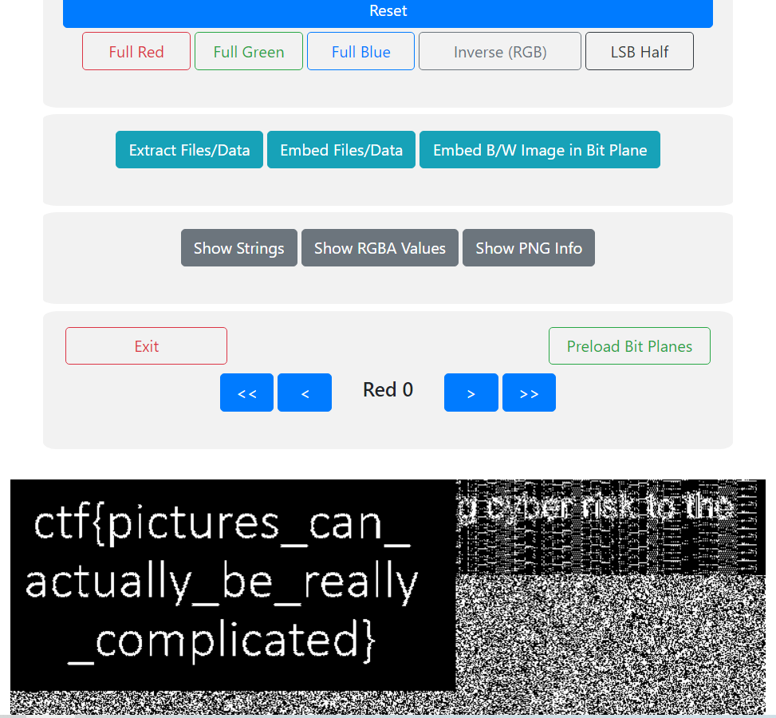

# Cyber Risk
**Level**: Medium

**Points**: 413

**Author**: Justin Applegate

**Description**:
```markdown
[steg-flag4.png]
```

## Writeup
If the picture is uploaded to an online steg service [like this one](https://stegonline.georgeom.net/upload), then the bit planes can be browsed. If the Red 0 bit plane is isolated, the flag can be seen.



**Flag** - `ctf{pictures_can_actually_be_really_complicated}`