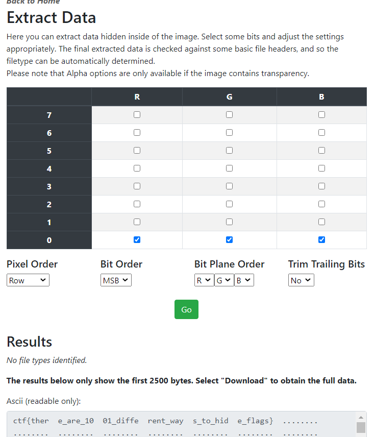

# Cyber Risk 2
**Level**: Medium

**Points**: 475

**Author**: Justin Applegate

**Description**:
```markdown
[steg-flag5.png]
```

## Writeup
The flag was hidden in this image by using LSB, or Least Significant Bit steganography. The flag was hidden as text in the LSB of the red, green, and blue pixels. If a website [like this one](https://stegonline.georgeom.net/) is used, and the 0 bit of R, G, and B is selected for extracting data, the flag can be discovered. 



**Flag** - `ctf{there_are_1001_different_ways_to_hide_flags}`