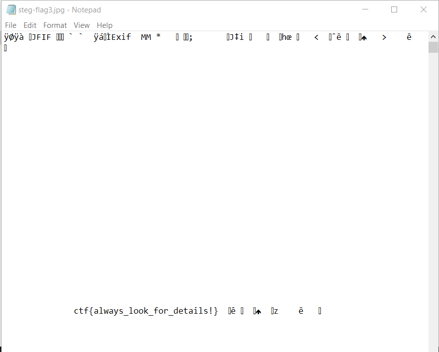

# Details
**Level**: Easy

**Points**: 359

**Author**: Justin Applegate

**Description**:
```markdown
Meta-what?

[steg-flag3.png]
```

## Writeup
The flag can be found by opening up the photo in Notepad. It was originally stored using a metadata comment, and so is also accessible through a Linux tool like `exiftool` or Windows photo details.



**Flag** - `ctf{always_look_for_details!}`