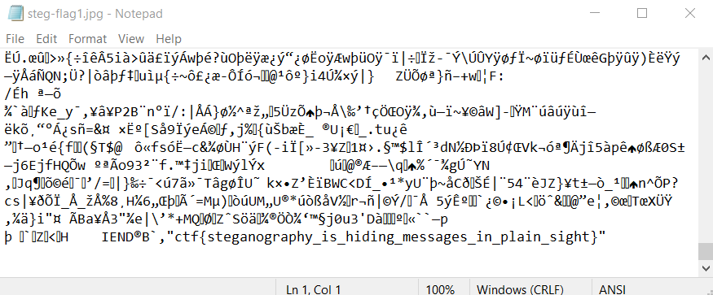

# Incorrect
**Level**: Easy

**Points**: 292

**Author**: Justin Applegate

**Description**:
```markdown
How do computers store photos?

[steg-flag1.png]
```

## Writeup
The flag was simply stored at the end of the photo. Opening it up in Notepad would yield these results. In addition, using `exiftool -v3` (verbose three times) would also reveal it since it notices the discrepancy in the photo bits.



**Flag** - `ctf{steganography_is_hiding_messages_in_plain_sight}`