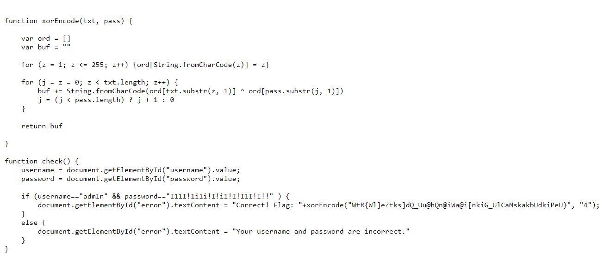

# Client-side
**Level**: Easy

**Points**: 316

**Author**: Justin Applegate

**Description**:
```markdown
[web-flag3.zip]
```

## Writeup
Unzipping the attached ZIP file resulted in three files - `index.html`, `index.css`, and `index.js`. The login form on `index.html` runs the `check()` function located on `index.js`. Looking at that file gives you the username and password needed for the login form. Entering the information results in the flag being printed on the page.



**Flag** - `ctf{client_side_authentication_is_always_a_bad_idea}`